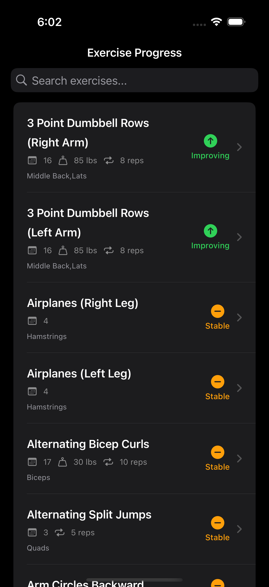
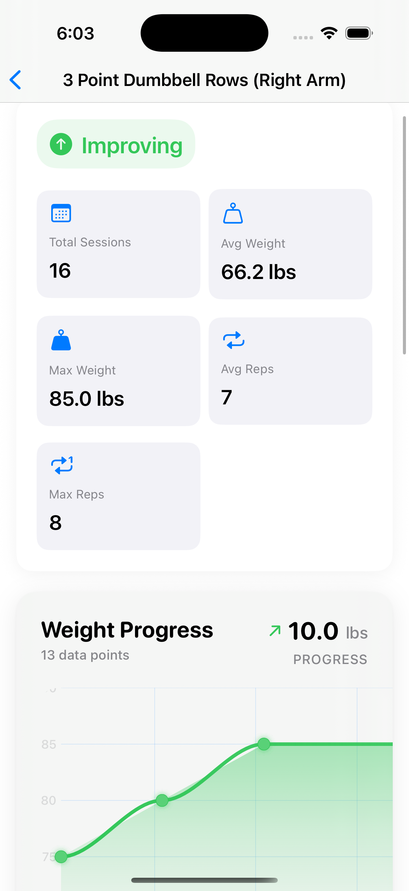
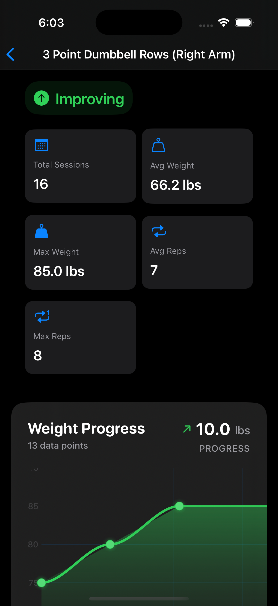
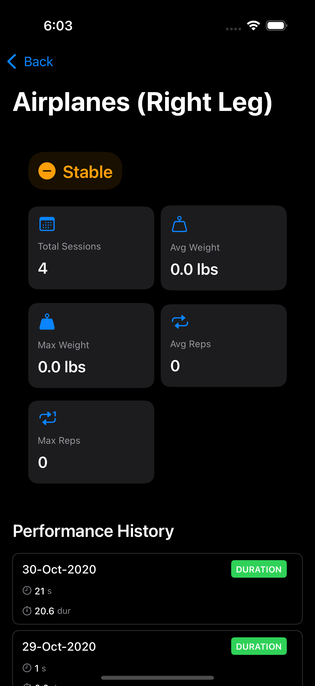
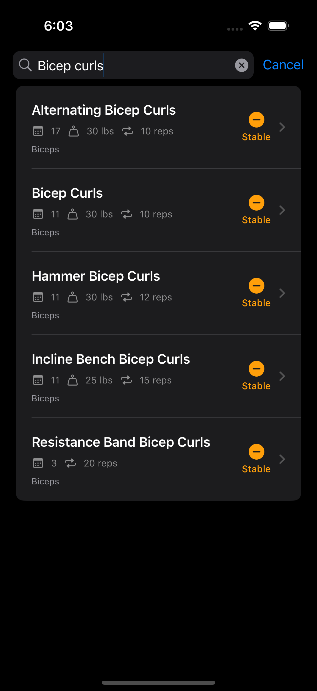
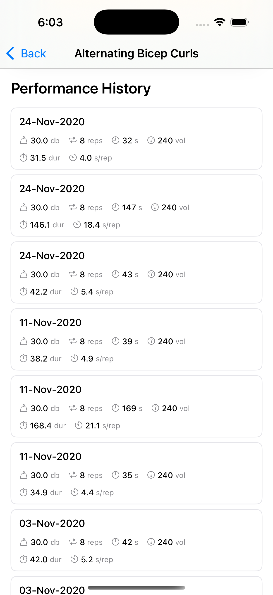
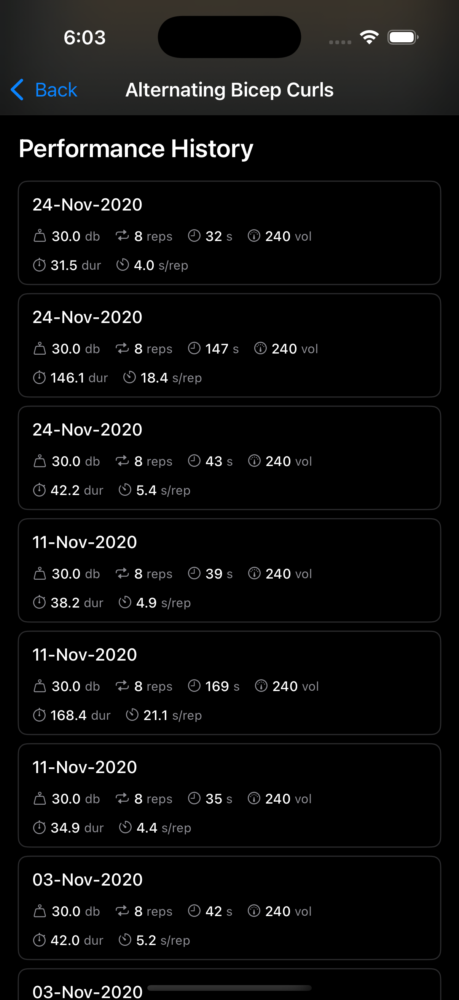

# HealthTracker

A SwiftUI-based iOS application for tracking exercise performance and visualizing workout progress over time.

## Architecture

### MVVM Pattern
- **Models**: Defines data structures for exercises, workouts, and performance metrics.
- **Views**: SwiftUI components with minimal business logic.
- **ViewModels**: Handles business logic, data processing, and state management.
- **Controllers**: Manages data loading and coordination.

### Project Structure
```
HealthTracker/
├── Models/                    # Data structures
├── Views/                     # SwiftUI Views
├── ViewModels/                # Business logic
├── Controllers/               # Data coordination
├── Helpers/                   # Utilities & extensions
└── Data/                      # JSON workout data
```

## Key Features

- **Performance Tracking**: Monitors weight, reps, duration, volume, and distance.
- **Progress Visualization**: Animated charts and color-coded indicators for showing progress trends.
- **Data-driven Design**: Comprehensive workout history and performance metrics.
- **User Experience**: Real-time search, responsive interface, and smooth animations.

### Requirements
- iOS 17.6+
- Xcode 16.0+
- Swift 5.9+

### Data Format
The app loads workout data from JSON files located in the `Data/summaries/` directory. Each JSON file represents a workout session.

## Demo

### Video Demo
[Watch Video Demo](./Video%20Demo.mp4)

### Screenshots

<div align="center">
  
  
</div>

<div align="center">
  
  
</div>

<div align="center">
  
  
</div>

<div align="center">
  
  
</div>

<div align="center">
  
  
</div>

<div align="center">
  
  
</div>

---

*Built with SwiftUI, following modern iOS development best practices and clean architecture principles.*
